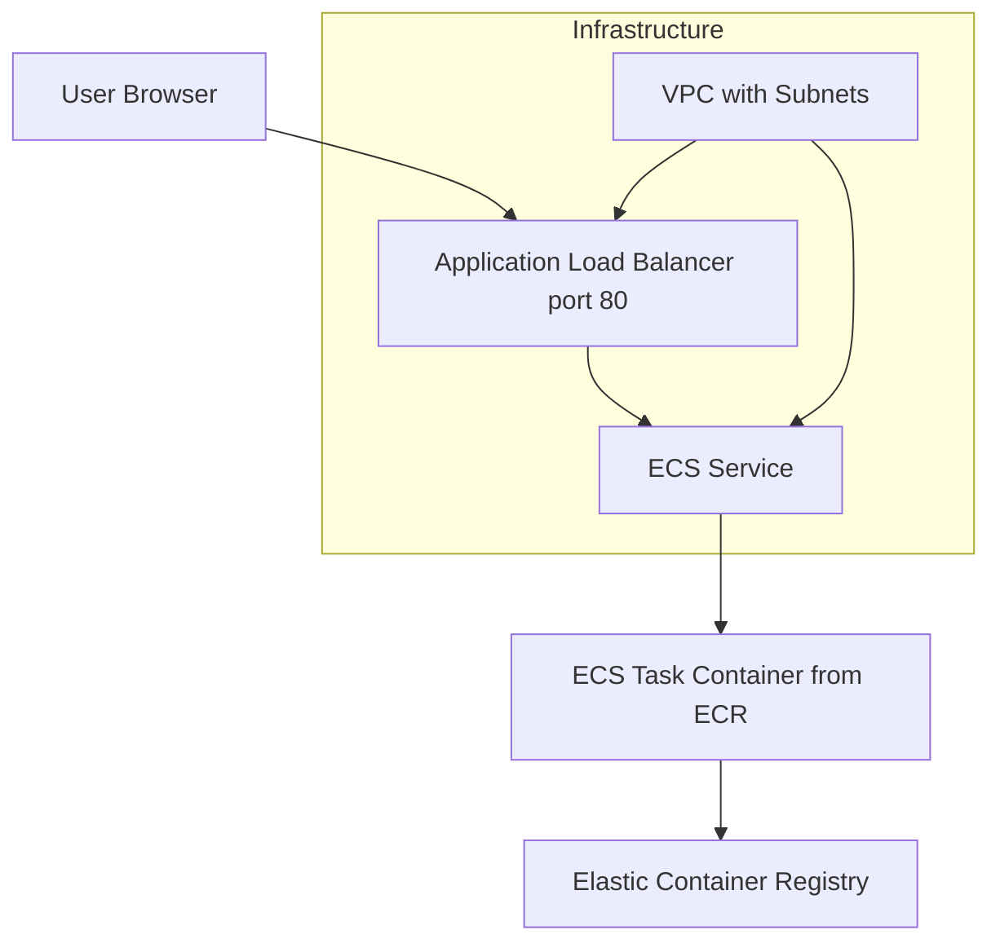
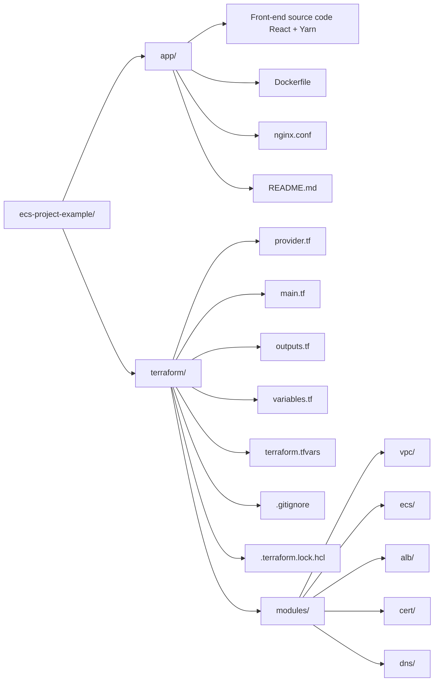

I have got this working but I do not have a domain so I got it working with HTTP and not HTTPS:

I have the code for it with HTTPS commented out.

To get the code running you simply run the GitHub Action and go to the link given as an output.

### Architecture Diagram

### Project Code Structure

